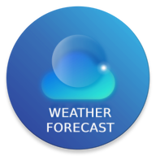
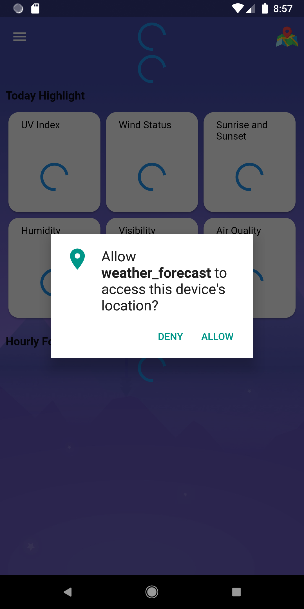
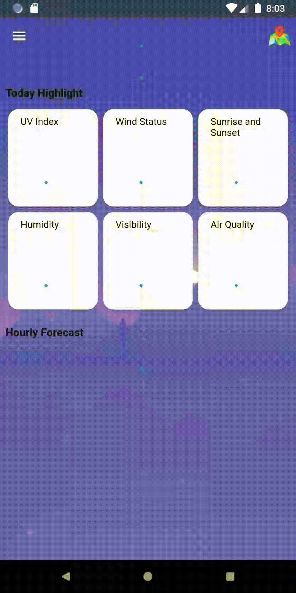

<p align="center">
<a href="#">

</a>
<h3 align="center">Weather Forecast</h3>
<p align="center">
    ☁️This is the open source of the weather forecast app☁️
</p>
</p>

## Table of contents

- [Quick start](#quick-start)
- [What's included](#whats-included)

## Quick start
The features:
- On opening the app for the first time, the application requires access to your location, by default it will take a location in the capital city of Hanoi, Vietnam.


- On next visit, the app automatically uses your current location (or last location) to display forecast results


- See the forecast at one location on the map


- Search location


- Others features: change layers map, change theme

## What's included
The application is implemented by flutter framework with BLoC pattern

```text
root/
└── assets/
    ├── constants/
    │   ├── international files
    └── images/
        └── image files
└── lib/
    ├── bloc/
    ├── dependencies/
    ├── global/
    ├── I10n/
    ├── models/
    ├── pages/
    ├── services/
    └── other files
```
